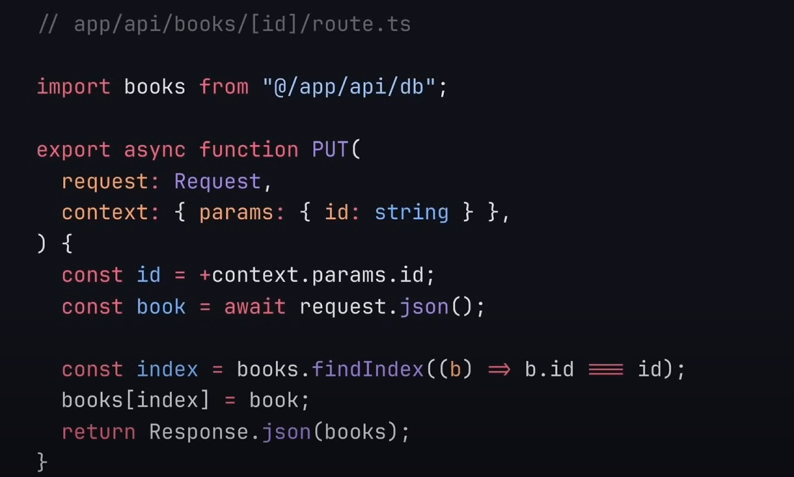
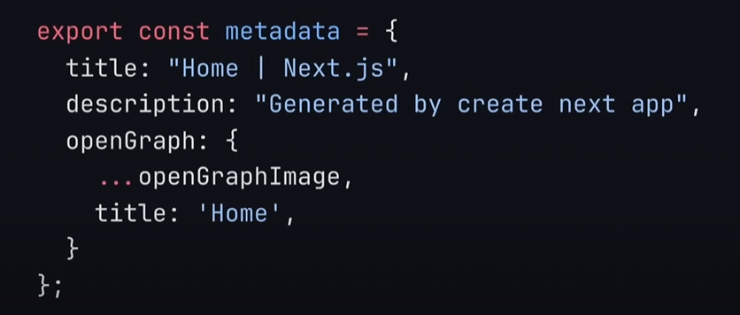
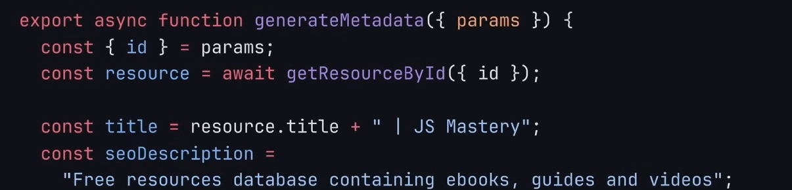
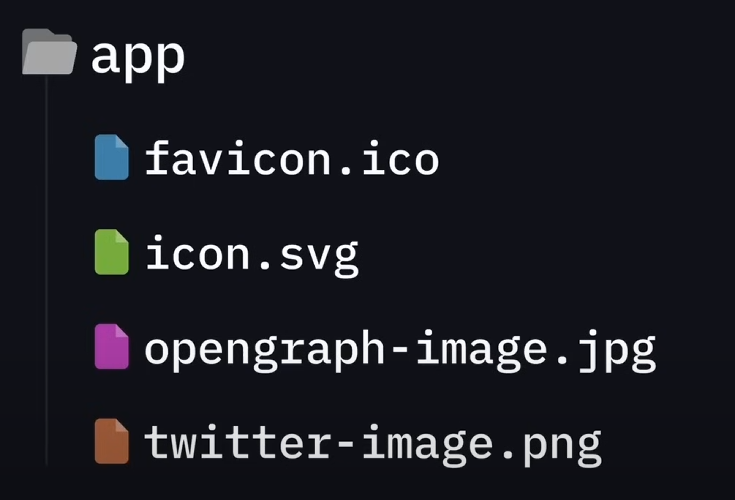

# Server API routes

The front end is done by creating a new folder app/api. In this special folder we can define the special file `route.ts` where by it becomes a special route such as the following which defines a PUT route for that specific path - this is a delete request with a dynamic route

If we navigate to a specific route that is an API then this api handles it

# Improve SEO in next.js
Using metadata 
- ConfigBased 
  - Create a javascript object in any page file and export it then nextjs will automatically detect these metadata
   (this is defualt in app default.tsx)
- Metadata can also be dynamic which can be generated on the fly by using fetch from the server and dynamic routes for specific page

then return a dynamic object

File based meta data
- robots.txt, favicon.ico, icon.svg, twitter-image.png etc will be added into the metadata placed directly into the app folder

Filebased metadata has a higher priotity than the config based.
