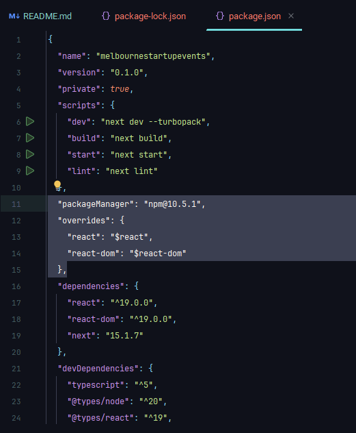

# Starting a project in nextjs
After installing next js make sure we add the following to package.json to ensure that next router and auth are also using the latest version of react

This ensure that latest versions of reat are used through all projects

## Authentication using Auth.js for login and creating user
https://authjs.dev/getting-started/installation?framework=next-js
following the guide
use `npm install next-auth@beta` then set up the environment as in the guide.
